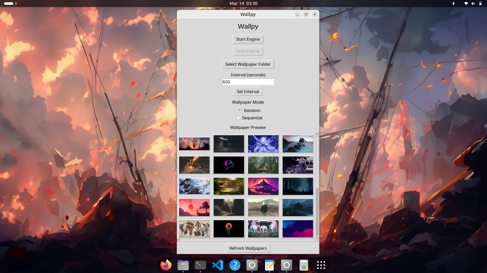

# Wallpy


Wallpy is a lightweight wallpaper manager for Linux that automatically rotates desktop wallpapers at configurable intervals.

It provides a simple graphical interface to preview wallpapers, choose a wallpaper folder, and control a slideshow engine that periodically updates the desktop background.

---

## Download

Download the latest version from the **GitHub Releases page**.

**Latest Release**

Wallpy-x86_64.AppImage

Run it:
```bash
chmod +x Wallpy-x86_64.AppImage
./Wallpy-x86_64.AppImage
```

No installation required.

---

## Screenshot




---

## Features

| Feature | Description |
|--------|-------------|
| Wallpaper slideshow | Automatically rotate wallpapers |
| Random / Sequential mode | Choose how wallpapers rotate |
| Wallpaper preview gallery | Preview wallpapers before applying |
| Folder selection | Use any folder of wallpapers |
| Lightweight GUI | Built using Python and Tkinter |
| Portable | Distributed as a standalone AppImage |

---

## Installation

Download the latest release from the **GitHub Releases page**.

Example file:
```bash
Wallpy-x86_64.AppImage
```

Make it executable:

```bash
chmod +x Wallpy-x86_64.AppImage
```

Run it:
```bash
./Wallpy-x86_64.AppImage
```
No installation required.

---

## Usage

#### Launch Wallpy :

- Select a wallpaper folder
- Set the interval for wallpaper changes
- Choose rotation mode (Random / Sequential)
- Click Start Engine

To stop wallpaper rotation, press Stop Engine.

---

Configuration

Wallpy stores configuration here:
```bash
~/.config/wallpy/config.json
```
Example configuration:
```bash
{
  "folder": "/home/user/Pictures/Wallpapers",
  "interval": 60,
  "mode": "random",
  "video": ""
}
```
---

## Project Structure
```bash
wallpy
│
├── wallpaper_engine
│   ├── app.py
│   ├── controller.py
│   ├── wizard.py
│   │
│   ├── core
│   │   └── static_engine.py
│   │
│   ├── utils
│   │   └── config_manager.py
│   │
│   └── assets
│       ├── icons
│       │   └── icon.png
│       │
│       └── wallpapers
│           ├── wp01.jpeg
│           ├── wp02.jpeg
│           ├── wp03.jpeg
│           └── ...
│
├── desktop
│   └── wallpy.desktop
│
├── scripts
│   └── launch.sh
│
├── requirements.txt
├── LICENSE
└── README.md
```
---

## Building From Source

Clone the repository:
```bash
git clone https://github.com/A9TiL/wallpy.git
cd wallpy
```
Create a virtual environment:
```
python3 -m venv build-env
source build-env/bin/activate
```
Install dependencies:
```
pip install pillow
```
Run the application:
```
python -m wallpaper_engine.app
```
---

## Building the AppImage

Build the standalone binary:
```bash
pyinstaller \
--onefile \
--windowed \
--name wallpy \
--hidden-import=PIL._tkinter_finder \
--hidden-import=PIL.ImageTk \
--add-data "wallpaper_engine/assets:wallpaper_engine/assets" \
wallpaper_engine/app.py
```
Then build the AppImage:
```
ARCH=x86_64 ./appimagetool-x86_64.AppImage AppDir
```

---

## Project Status

Wallpy v1.0 is stable and functional.

Current features include:

* GUI wallpaper manager
* Automatic wallpaper slideshow
* Random and sequential modes
* Wallpaper preview gallery
* Portable AppImage distribution


---

## Roadmap

#### Planned improvements:

- Video wallpaper support

- Multi-monitor support

- Wayland compatibility

- System tray controls

- Faster wallpaper preview loading
  
---

## Contributing

### Contributions are welcome.

#### You can help by:

- reporting bugs

- suggesting features

- improving the UI

- optimizing wallpaper loading

Open an issue or submit a pull request.

---

## License

### This project is licensed under the MIT License.

See the `LICENSE` file for details.

---
## Author
### A9TiL

Github: https://github.com/A9TiL
